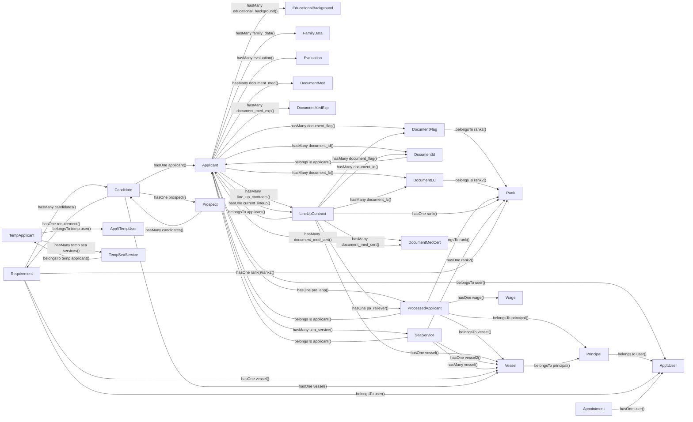

# Model Relationships

This diagram is based on the Eloquent relationship methods in `app/Models`.
It favors the domain model links declared in code over database-only naming assumptions.

## Isolated Or Undeclared

These models exist in `app/Models`, but no relationship method was found in the model search:

- `AuditTrail`
- `ExportLogs`
- `File`
- `Interview`
- `Opening`
- `Role`
- `Ssap`
- `Statistic`

## Notes

- `LineUpContract` uses applicant-level document relationships by matching `applicant_id` to its own `applicant_id`.
- Some relationships named as `hasOne` are lookup-style links where the current model stores the foreign key, such as `Candidate -> Requirement`, `Candidate -> Applicant`, and `Requirement -> Vessel`.
- `ProcessedApplicant::wage()` matches on `vessel_id` and also filters by the current `rank_id`.
